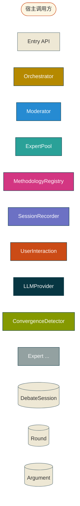
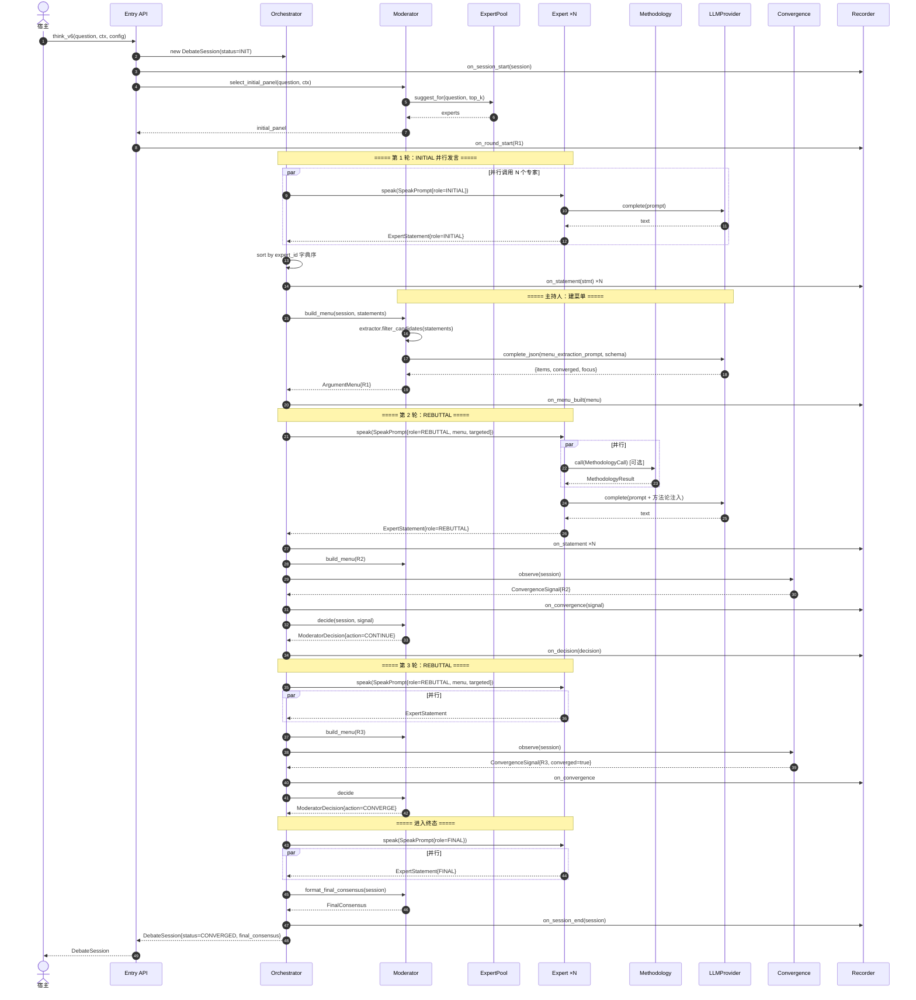
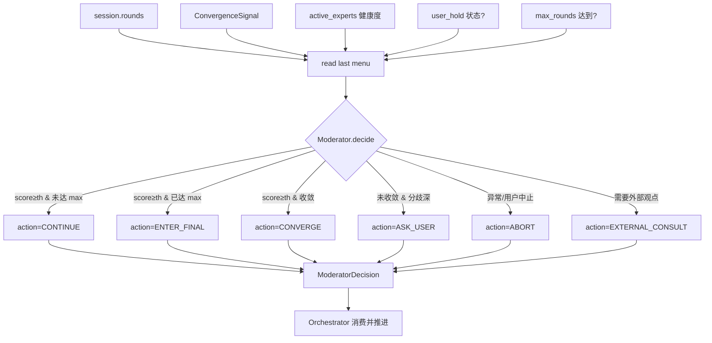
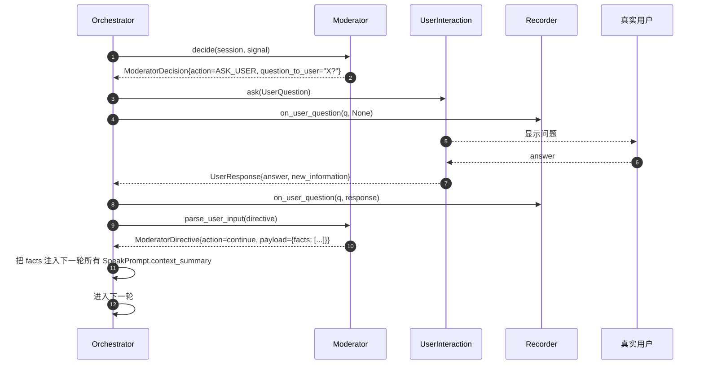
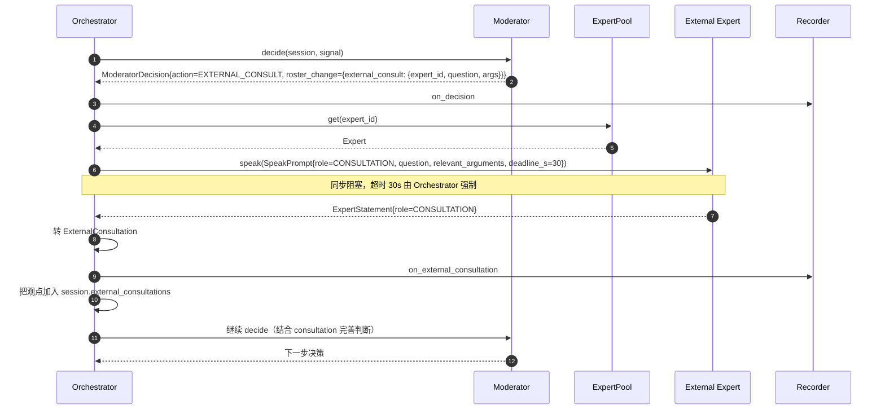
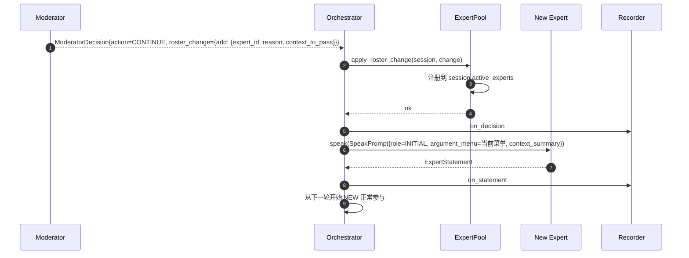
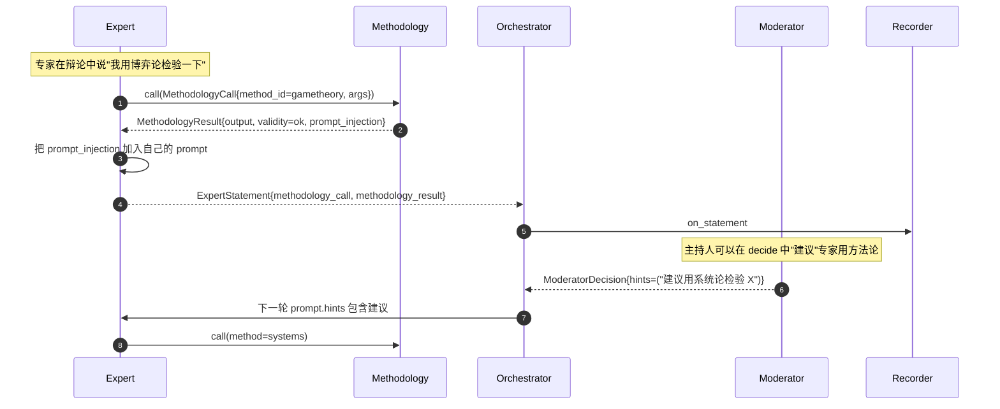

# 超思考 v6 · 端到端数据流

> 状态：Phase 1 设计稿
> 日期：2026-06-05
> 范围：正常流、收敛流、用户介入流、最大轮次兜底流、外部咨询流

---

## 0. 图例



---

## 1. 正常流（Happy Path：3 轮收敛）



---

## 2. 收敛信号计算（数据流细节）

```mermaid
flowchart TD
    A[Round N-1 菜单 M_{N-1}] --> C[overlap_rate]
    B[Round N 候选 suggested_args ×N] --> C
    B --> D[new_arg_density]
    E[Round N-1 各专家 conf] --> F[confidence_drift]
    G[Round N 各专家 conf] --> F
    C --> H[score = 0.4·overlap + 0.4·(1-density_norm) + 0.2·(1-drift)]
    D --> H
    F --> H
    H --> I{score ≥ threshold<br/>持续 N 轮?}
    I -- yes --> J[converged=true]
    I -- no --> K{硬规则触发?<br/>overlap≥0.70 ∧ density<0.50}
    K -- yes --> J
    K -- no --> L[converged=false]
    J --> M[ConvergenceSignal]
    L --> M
```

实现位置：`v6/convergence/detector.py::observe(session)`。

---

## 3. 主持人决策（Decision）数据流



---

## 4. 用户介入流（ask_user）



---

## 5. 最大轮次兜底流（max_rounds 达到但未收敛）

```mermaid
flowchart TD
    A[Round N=1..max_rounds-1] --> B[Round max_rounds]
    B --> C[build_menu]
    C --> D[ConvergenceDetector.observe]
    D --> E{converged?}
    E -- yes --> F[enter_final]
    E -- no --> G[检查 max_rounds]
    G -- 未达 --> H[continue]
    G -- 已达 --> I[强制 ENTER_FINAL]
    I --> J[专家 FINAL 发言]
    J --> K[format_final_consensus<br/>标记 status=MAX_ROUNDS]
    K --> L[on_session_end]
    L --> M[返回 DebateSession{status=MAX_ROUNDS}]
    H --> A
    F --> J
```

主持人日志会输出："达到 max_rounds={N} 仍未收敛，强制进入终态"。

---

## 6. 外部咨询流（external_consultation）



每轮最多 `config.max_external_consultations_per_round` 次咨询；超限则报 ModeratorError 并降级为"无外部咨询"决策。

---

## 7. v5 兼容流（Jury().think 走 v6 单轮退化模式）

```mermaid
flowchart TD
    A[旧调用: Jury().think input,ctx,mode] --> B[v5 Jury.__init__]
    B --> C{JuryAdapter<br/>enabled?}
    C -- yes --> D[v6.compat.jury_adapter.adapt]
    C -- no --> E[原始 v5 逻辑]
    D --> F[DebateSession{mode=NON_DEBATE, max_rounds=1}]
    F --> G[Router.route(input, mode)]
    G --> H[激活的 Perspective 列表]
    H --> I[ThreadPoolExecutor 并行]
    I --> J[每个 Perspective 走 V5PerspectiveAdapter.speak]
    J --> K[Role=INITIAL, 不要求针对性]
    K --> L[skip ConvergenceDetector<br/>直接 enter_final]
    L --> M[format_final_consensus via v5 Formatter]
    M --> N[to_v5_jury_result<br/>JuryResult.outputs 仍是 PerspectiveOutput]
    N --> O[返回 v5 兼容的 JuryResult]
    E --> P[v5 原始行为]
```

关键点：
- v5 JuryResult 字段全部保留
- `outputs` 字典 value 是 `PerspectiveOutput`（**不是** `ExpertStatement`）
- 测试 `tests/test_core.py` 全部继续通过

---

## 8. 新专家加入流（动态池）



新专家**不**读完整辩论历史，只接收"当前核心论点 + 正在讨论的问题"，避免上下文膨胀。

---

## 9. 方法论调用流



主持人有"乱用防护"权：`MethodologyProvider.is_applicable(claim, context)` 返回 False 时，主持人可在 hint 中提醒。

---

## 10. 终止条件一览

| 触发 | 行为 | 终态 status |
|------|------|-------------|
| `converged=true` | ENTER_FINAL | `converged` |
| `round_number == max_rounds` 且未收敛 | ENTER_FINAL | `max_rounds` |
| 主持人 ASK_USER 且用户回答"跳过" | 立即 ENTER_FINAL | `user_hold` → `completed` |
| 主持人 ABORT（用户主动中止） | 立即停 | `aborted` |
| Orchestrator 内部异常 | 兜底 ABORT | `aborted` |
| 专家数 < `min_experts_to_continue` | 强制 ENTER_FINAL | `completed` |

---

## 11. 数据流不变量

| # | 不变量 | 校验点 |
|---|--------|--------|
| F1 | 每个 Round 的 statements 数量 = active_experts 数量（除非某 expert 失败） | Orchestrator.run_single_round 末尾 |
| F2 | 每个 Round 的 menu.items ⊆ suggested_arguments（主持人过滤后） | build_menu 返回前 |
| F3 | ConvergenceSignal.round_number == 最新 Round 编号 | ConvergenceDetector.observe |
| F4 | ModeratorDecision 必有 reason | 构造时校验 |
| F5 | ExternalConsultation.request.expert_id ∈ session.active_experts ∪ registry | apply_roster_change 校验 |
| F6 | Recorder 必须被每个事件触发 1 次（no-op recorder 也接收） | 单元测试 |
| F7 | DebateSession.status 转移合法（INIT→RUNNING→{CONVERGED,MAX_ROUNDS,ABORTED,COMPLETED,USER_HOLD}） | SessionOrchestrator 状态机 |
| F8 | v5 JuryResult.outputs 的 key ⊆ v5 PerspectiveRegistry 注册的 ID | to_v5_jury_result |

---

## 12. Recorder 事件序列（正常流预期顺序）

```
on_session_start
on_decision              (initial panel)
on_round_start (R1)
on_statement ×N
on_menu_built (R1)
on_convergence (R1)
on_decision (R1 → continue)
on_round_start (R2)
on_statement ×N
on_menu_built (R2)
on_convergence (R2)
on_decision (R2 → continue)
on_round_start (R3)
on_statement ×N
on_menu_built (R3)
on_convergence (R3 → converged)
on_decision (R3 → converge)
on_statement ×N          (final stmts)
on_session_end
```

QA 测试断言上述顺序（用 InMemoryRecorder 捕获事件流）。

---

_楚灵 · 数据流 Phase 1 · 2026-06-05_
